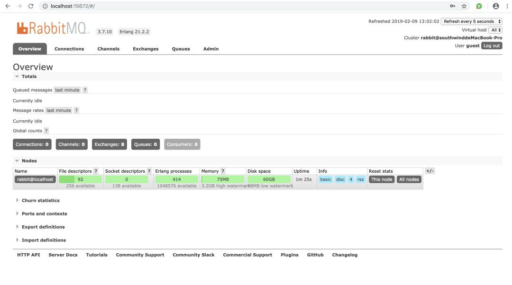
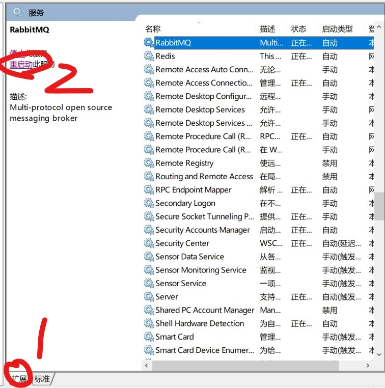

# 安装


## MacOS

```
brew install rabbitmq
```


RabbitMQ安装后的路径为：`/usr/local/Cellar/rabbitmq/3.8.2 `(版本根据安装版本确定)


此时在浏览器输入`http://localhost:15672`即可进入rabbitmq控制终端登录页面，默认用户名和密码为 guest/guest.


```
brew services start rabbitmq
```


备注：

brew提速方法，在开始之前，先设置终端的代理，需要vpn

```
export ALL_PROXY=socks5://127.0.0.1:1086
```


## Windows

Windows 下安装 RabbitMQ

1、安装 Erlang，RabbitMQ 服务端代码是用 Erlang 编写的，所以安装 RabbitMQ 必须先安装Erlang。

进入官网：

http://www.erlang.org/downloads，下载 exe 安装包，双击运行完成安装。

2、配置环境变量，与 Java 环境配置方式一致。

高级系统设置-->环境变量-->新建系统环境变量，变量名：`ERLANG_HOME`，变量值为 Erlang 的安装路径：`D:\Program Files\erl9.2`，注意这里替换成你自己的安装路径。

将`;%ERLANG_HOME%\bin`加入到path中。

3、安装 RabbitMQ

进入官网：

http://www.rabbitmq.com/install-windows.html ，下载 exe 安装包，双击运行完成安装。

配置环境变量，与 Java 环境配置方式一致。

高级系统设置-->环境变量-->新建系统环境变量，变量名：`RABBITMQ_SERVER`，变量值为 RabbitMQ 的安装路径：`D:\Program Files\RabbitMQ Server\rabbitmq_server-3.7.10`，注意这里替换成你自己的安装路径。

将`;%RABBITMQ_SERVER%\sbin`加入到path中。

安装完成后，打开计算机服务列表，可以看到 RabbitMQ 的服务了，如下图所示。


4、安装 RabbitMQ 管理插件

进入安装路径下的 sbin 目录，如下所示。

```javascript
cd D:\Program Files\RabbitMQ Server\rabbitmq_server-3.7.10\sbin>
```

执行如下命令，安装管理插件。

```javascript
rabbitmq-plugins enable rabbitmq_management
```

打开浏览器在地址栏输入：

http://localhost:15672/，进入登录页面。


输入用户名密码，均为 guest，即可进入主页面。



### Windows10安装遇到的问题

1. 安装erlong一直不出现bin文件夹

   解决方法：

   1. 重装（重装不行，使用2方案）
   2. 复制别人的bin文件夹，修改其中的`erl.ini`配置文件，将其改成你自己安装的路径

2. 安装rabbitmq后没有没有RabbitMQ服务

   解决方法：

   1. 以管理员身份运行cmd，进入到RabbitMQ安装路径，进入到其sbin文件夹下

   2. 输入命令`rabbitmq-service.bat install`

      注意：如果不以管理员身份运行cmd，会出现乱码错误

3. 有RabbitMQ服务之后，显示启动失败

   解决方案：

   打开服务，顺序点击

   

