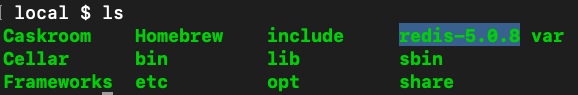
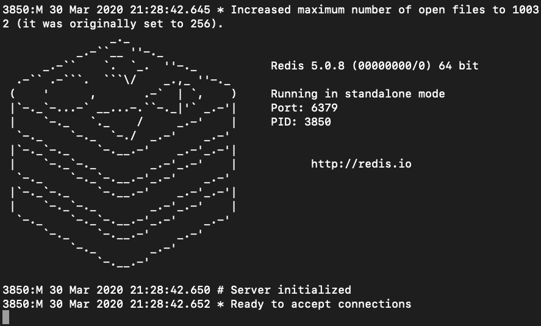
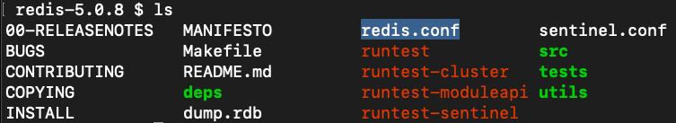
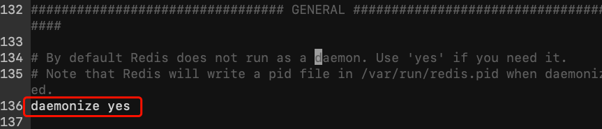
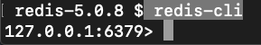

# 安装Redis

## 下载redis

https://redis.io/

window 版本下载路径：https://github.com/MicrosoftArchive/redis/releases

# MacOS下安装redis

将redis安装包解压到 /usr/local




进入安装包

```cd /usr/local/redis-5.0.8/ ```

编译测试 

```sudo make test ```

编译安装 

```sudo make install```

redis将被安装到了 

```/usr/local/bin```

## 启动redis

```
redis-server
```

启动之后，将阻塞命令窗口，如果窗口关闭程序就退出了



如果设置reids.conf里的属性daemonize为yes则可以后台运行，默认daemonize是no。我们需要手动将其设置为yes。redis.conf这个文件在我们下载的reids的安装包里



编辑redis.conf 



运行redis并指定配置文件

```
redis-server /usr/local/redis-5.0.8/redis.conf
```

## 查看redis的运行状态

```
 ps -ef | grep redis
```

显示如下

```
  501  3895     1   0  9:32下午 ??         0:00.09 redis-server 127.0.0.1:6379 
  501  3903  3783   0  9:33下午 ttys000    0:00.01 grep redis
```

或者显示redis的监听端口，默认监听6379

```
lsof -i :6379
```

显示如下

```
COMMAND    PID USER   FD   TYPE             DEVICE SIZE/OFF NODE NAME
redis-ser 3942 liyi    6u  IPv4 0xb3aa737832b9f213      0t0  TCP localhost:6379 (LISTEN)
```

## 关闭redis

```
redis-cli shutdown
```


# redis-cli

开启命令行工具，连接redis服务，直接运行以下命令

```
redis-cli
```

进入到命令行模式，默认cli连接127.0.0.1:6379



可以指定ip和端口号如下

```
redis-cli -h {ip} -p {端口}
```

例如

```
redis-cli -h 127.0.0.1 -p 6379
```

 这个命令也可以访问远程的redis服务。


命令参考

http://redisdoc.com

# Windows10 安装

window 版本下载路径：https://github.com/MicrosoftArchive/redis/releases

1. 安装完成后，打开cmd，进入Redis安装目录，执行

   ```
   redis-server.exe redis.windows.conf
   ```

2. 若出现错误，依次执行一下命令

   ```
   redis-cli.exe
   shutdown
   exit
   ```

3. 在服务中将redis服务设置为自动


