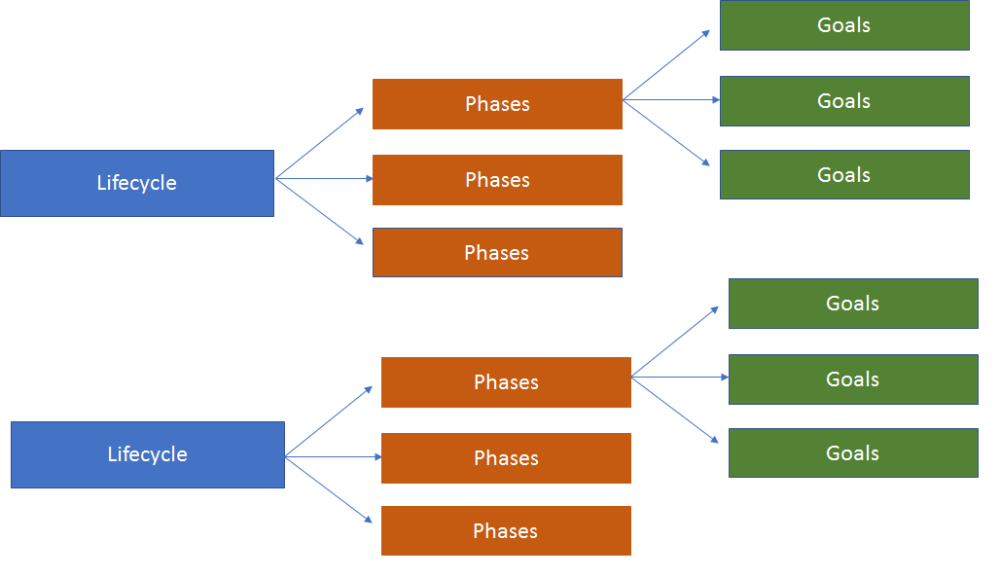
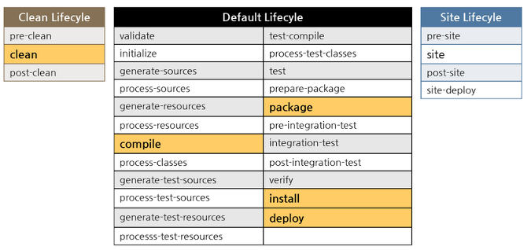
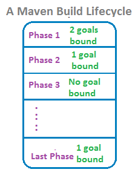
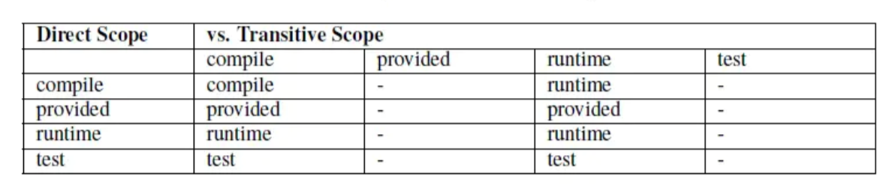

## 创建一个Maven项目

### 使用项目模板

```
mvn archetype:generate
```

archetype是maven的一个插件 maven-archetype-plugin

generate是插件的一个执行目标(goal)，这个目标就是根据一个项目模板生成项目的结构目录和文件

将进入到` Interactive mode`即交互模式，输入一些创建项目依赖的选项。

```
Choose archetype:
1: internal -> org.apache.maven.archetypes:maven-archetype-archetype (An archetype which contains a sample archetype.)
2: internal -> org.apache.maven.archetypes:maven-archetype-j2ee-simple (An archetype which contains a simplifed sample J2EE application.)
3: internal -> org.apache.maven.archetypes:maven-archetype-plugin (An archetype which contains a sample Maven plugin.)
4: internal -> org.apache.maven.archetypes:maven-archetype-plugin-site (An archetype which contains a sample Maven plugin site.
      This archetype can be layered upon an existing Maven plugin project.)
5: internal -> org.apache.maven.archetypes:maven-archetype-portlet (An archetype which contains a sample JSR-268 Portlet.)
6: internal -> org.apache.maven.archetypes:maven-archetype-profiles ()
7: internal -> org.apache.maven.archetypes:maven-archetype-quickstart (An archetype which contains a sample Maven project.)
8: internal -> org.apache.maven.archetypes:maven-archetype-site (An archetype which contains a sample Maven site which demonstrates
      some of the supported document types like APT, XDoc, and FML and demonstrates how
      to i18n your site. This archetype can be layered upon an existing Maven project.)
9: internal -> org.apache.maven.archetypes:maven-archetype-site-simple (An archetype which contains a sample Maven site.)
10: internal -> org.apache.maven.archetypes:maven-archetype-webapp (An archetype which contains a sample Maven Webapp project.)
Choose a number or apply filter (format: [groupId:]artifactId, case sensitive contains): 7: 7
Define value for property 'groupId': club.banyuan
Define value for property 'artifactId': my-app
Define value for property 'version' 1.0-SNAPSHOT: : 
Define value for property 'package' club.banyuan: : 
Confirm properties configuration:
groupId: club.banyuan
artifactId: my-app
version: 1.0-SNAPSHOT
package: club.banyuan
 Y: : 
```


#### Maven插件

Maven本质上是一个插件管理工具，它的核心并不具备执行任何具体任务的功能，所有这些任务都交给插件来完成。插件相当于一组功能的合集。Maven 的插件位于 ${REPOSITORY_HOME}\org\apache\maven\plugins。用户和 Maven 最直接的交互方式就是调用这些插件来完成任务。

#### Goal

插件的每个功能可以被称作一个目标goal。可以理解为插件是一个类，goal就是类对外提供的方法，每个方法名字是一个goal。

如果想要查看一个插件中有多少个方法，可以使用

```
mvn <插件名>:help
```

例如

```
mvn archetype:help
## 将输出以下内容，略去一些描述
This plugin has 7 goals:

archetype:crawl
  Crawl a Maven repository (filesystem, not HTTP) and creates a catalog file.

archetype:create-from-project
  Creates an archetype project from the current project.

archetype:generate
  Generates a new project from an archetype, or updates the actual project if
  using a partial archetype. If the project is fully generated, it is generated
  in a directory corresponding to its artifactId. If the project is updated with
  a partial archetype, it is done in the current directory.

archetype:help
  Display help information on maven-archetype-plugin.
  Call mvn archetype:help -Ddetail=true -Dgoal=<goal-name> to display parameter
  details.

archetype:integration-test

archetype:jar
  Build a JAR from the current Archetype project.

archetype:update-local-catalog
  Updates the local catalog
```

可以看到，help 实际上也是这个插件需要提供的一项功能，用来输出这段文字描述。

执行插件的指定goal的语法

```
mvn <插件名>:<目标名>
```

#### 构件和模板

maven主要的功能之一就是管理项目依赖的jar包，这些jar包在maven看来就是一个一个的构件(archetype)，Maven所管理的插件，也会被看做是一个一个的构件。

archetype 被当做名词出现在文档的时候，表示的就是构件(jar或者插件)。出现在命令行中，表示的为maven-archetype-plugin这个插件名称。我们所创建出来的项目，在Maven看来也是一个构件。

在创建构件时，可以使用一些预设的模板，主要好处是使开发人员创建的项目标准化。

常用的模板有两个

```
# 用来创建java可执行应用
org.apache.maven.archetypes:maven-archetype-quickstart

# 用来创建java的服务器应用
org.apache.maven.archetypes:maven-archetype-webapp
```

#### GAV

Maven的构件必须要声明的三个字符串，这三个字符串组合相当于构件的身份证号码。主要用于从maven仓库中查询该构件。

俗称GAV，也就是下面英文字母的首写，也叫做Maven坐标

- G

  groupId 一般来代表公司或组织名称，通常为域名的倒序如：club.banyuan

  groupId 和 package不同，package为包路径，是java的概念， groupId是Maven的概念，通常也是使用公司域名的倒序。

  通常package的起始的几级路径恰好是groupId

- A

  artifactId 一般来代表模块名称，如：my-app

  命名推荐使用小写字母，没有其他的特殊字符，使用`项目名称-模块名称`的方式定义，例如：spirng-mvn、spring-core等。

- V

  version 模块版本，如：1.0-SNAPSHOT

通过这三个标识就可以唯一地确定jar包在maven仓库中的唯一地址了，然后就可以找到对应的jar包。


#### Maven仓库

集中存储这些构件的地方叫做Maven仓库。Maven仓库分为本地仓库和远程仓库

- 本地仓库  

  一个构件只有在本地仓库存在之后, 才能由Maven项目使用。当本地仓库找不到依赖的构件，maven会根据配置到远程仓库进行下载到本地仓库后再使用。

  默认情况下，每个用户在自己的用户目录下都有一个路径名为 .m2/respository/ 的仓库目录。

  Maven 本地仓库默认被创建在 %USER_HOME% 目录下。要修改默认位置，在 ~/.m2/settings.xml 目录中的 Maven 的 settings.xml 文件中定义另一个路径。

  ```
  <?xml version="1.0" encoding="UTF-8"?>
  <settings xmlns:xsi="http://www.w3.org/2001/XMLSchema-instance"
            xmlns="http://maven.apache.org/SETTINGS/1.0.0"
            xsi:schemaLocation="http://maven.apache.org/SETTINGS/1.0.0 http://maven.apache.org/xsd/settings-1.0.0.xsd">
      <localRepository>新仓库路径</localRepository>
  </settings>
  ```

  当你运行 Maven 命令，Maven 将下载依赖的文件到你指定的路径中。

- 远程仓库 

  远程仓库分为中央仓库和私库

  - 中央仓库

    由 Maven 社区提供的仓库，其中包含了大量常用的库。https://repo1.maven.org/maven2/

    中央仓库包含了绝大多数流行的开源Java构件，以及源码、作者信息、SCM、信息、许可证信息等。一般来说，简单的Java项目依赖的构件都可以在这里下载到。

    如果想要向中央仓库提交自己开发的构件，可以参考：

    http://www.cnblogs.com/EasonJim/p/6671419.html

    http://blog.csdn.net/hj7jay/article/details/51130398

  - 私库

    局域网或者指定组织才能使用的仓库。很多公司都搭有自己的私库，当用户想私库请求一个构件，私库中不存在，它通常会先去中央仓库请求，然后缓存下来再为用户提供下载。

#### 配置仓库镜像

maven中央库在国外,有时候访问会很慢,尤其是下载较大的依赖的时候,有时候速度会很慢,甚至会出现无法下载的情况。为了解决依赖下载速度的问题,需要配置maven国内镜像。

修改 ~/.m2/settings.xml ，在`<mirrors>`增加如下

```xml
<mirror>
  <id>nexus-aliyun</id>
  <mirrorOf>*</mirrorOf>
  <name>Nexus aliyun</name>
  <url>http://maven.aliyun.com/nexus/content/groups/public</url>
</mirror>
```

修改后的xml内容大概如下

中进行配置会对所有maven工程有效,当在升级maven版本的时候,需要注意复制已经配置好的settings.xml到新的maven目录下


```xml
<?xml version="1.0" encoding="UTF-8"?>
<settings xmlns:xsi="http://www.w3.org/2001/XMLSchema-instance"
          xmlns="http://maven.apache.org/SETTINGS/1.0.0"
          xsi:schemaLocation="http://maven.apache.org/SETTINGS/1.0.0 http://maven.apache.org/xsd/settings-1.0.0.xsd">
    <mirrors>
        <mirror>
            <id>nexus-aliyun</id>
            <mirrorOf>*</mirrorOf>
            <name>Nexus aliyun</name>
            <url>http://maven.aliyun.com/nexus/content/groups/public</url>
        </mirror>
    </mirrors>
</settings> 
```

#### 快照（SNAPSHOT）版本介绍

在 Maven 中，任何一个项目和构件都必须有自己的版本。版本的值可能是 1.0.0、1.0-alpha-4、1.3-SNAPSHOT 等，其中 1.0.0、1.0-alpha-4 是稳定的发布版本，而 1.3-SNAPSHOT 为不稳定的快照版本。

##### 为什么使用快照版本

我们在开发阶段经常性的会有很多公共库处于不稳定状态，随时需要修改并发布，可能一天就要发布一次，遇到bug时，甚至一天要发布N次。我们知道，maven的依赖管理是基于版本管理的，对于发布状态的artifact，如果版本号相同，即使我们内部的镜像服务器上的组件比本地新，maven也不会主动下载的。如果我们在开发阶段都是基于版本号来做依赖管理，那么遇到这个问题，就需要升级组件的版本号。但是，如果是基于快照版本，那么问题就自热而然的解决了，而maven已经为我们准备好了这一切。

假设张三在开发用户管理模块的 1.1 版本，该版本还没有正式发布。李四在开发权限管理模块。其中，权限管理模块的功能是依赖用户管理模块的。

在开发过程中，张三经常要将最新的用户管理模块构建输出，交给李四，让他对权限管理模块进行开发集成和调试。这种问题，如果由用户自己手动控制的话，相对比较麻烦。但 Maven 基于快照机制，就能自动解决这个问题。

基于 Maven 的快照机制，张三只需将用户管理模块的版本设置成 1.1-SNAPSHOT，然后发布到私服中。

在发布过程中，Maven 会自动为构件打上时间戳，比如 1.1-20161211.111111-11，表示 2016 年 12 月 11 日 11 点 11 分 11 秒的第 11 次的快照。有了这个时间戳，Maven 就能随时找到仓库中用户管理构件 1.1-SNAPSHOT 版本的最新文件。

这时，李四配置对用户管理模块的 1.1-SNAPSHOT 版本的依赖，当他构建权限管理模块的时候，Maven 会自动从仓库中检测用户管理 1.1-SNAPSHOT 的最新构件，发现最新构件后就自动下载。

Maven 默认情况下，每天检测一次（具体实际情况，由参考配置的 updatePolicy 控制），当然，也可以使用 mvn -U 强制让 Maven 检测更新。如 `mvn clean install -U`。

基于这样的机制，李四在准备调试时，可以让张三将现有最新的用户管理模块的快照版本发布到仓库，李四在构建的时候Maven将会从仓库中获取最新的快照版本，这些所有的一切都由 Maven 自动完成。

快照版本只应该在开发团队内部的项目或模块之间依赖使用。这个时候，团队成员对这些快照版本的依赖具有完全的理解和控制权利。

项目不应该依赖任何团队外部的快照版本依赖。由于快照版本的不稳定性，这样的依赖会造成潜在的危险。也就是说，即使项目构建这次成功了，由于外部的快照版本依赖会随时间改变而再次更新，下次构建的时候有可能会失败。

##### SNAPSHOT之殇

SNAPSHOT版本的依赖因为存在变更传达的透明性的优势而被赏识，甚至被“溺爱”，有很多团队索性直接使用SNAPSHOT到生产环境中，这样对于变更直接生效，很方便。但是作为技术人员的我们其实应该很严谨地看待变更传达的透明性，变更就意味着风险，透明性更是把风险彻底隐藏了起来，生产环境中存在这样的现象更是心惊胆战。例如：A-->B.1.0.3-SNAPSHOT，B对一个A使用的功能实现进行了调整，直接发布到仓库，A重新构建或许就会失败，更糟糕的是构建成功，运行时异常。这个时候A甚至完全没有代码变更就突然失败了，会带来更多的困惑。

这也是maven经常遭人诟病的一个因素，对于同一份代码，构建结果却不具备确定性，让很多人沮丧。当然这个不完全是因为依赖的问题，也有maven插件的问题，maven之前的版本寻找插件策略的方式也存在不确定性，maven在版本2的时候，会去寻找最新的插件版本（如果没配置的话）来执行构建，经常会找到SNAPSHOT版本的插件，所以依赖了一个不稳定的插件来执行构建，不确定性就大大增加。不过maven在3版本就改变了这个策略，会寻找最新稳定版的插件来执行构建，使得构建具备了确定性，稳定性也好多了。说明maven本身也在SNAPSHOT的问题上狠狠摔了一跤。

归根到底，这些问题的根源就是SNAPSHOT是变化的，是不稳定的，而应用（软件）依赖于变化并且不稳定的SNAPSHOT的依赖会导致自身也在变化和不稳定中，这是稳定性的一个大忌，依赖不稳定的服务或者依赖，上述的maven2的问题就是一个典型反例。

##### RELEASE简介

RELEASE版本和SNAPSHOT是相对的，非SANPSHOT版本即RELEASE版本，RELEASE版本是一个稳定的版本号，看清楚咯，是一个，不是一系列，可以认为RELEASE版本是不可变化的，一旦发布，即永远不会变化。

虽然RELEASE版本是稳定不变的，但是仓库还是有策略让这个原则变得可配置，有的仓库会配置成redeploy覆盖，这样RELEASE版本就变成SNAPSHOT了，伪装成RELEASE的SNAPSHOT，会让问题更费解和棘手，我一般称这类人为“挖坑专家”。

记住，RELEASE一旦发布，就不可改变。

##### 如何选择

那么什么时候使用SNAPSHOT？什么时候使用RELEASE?这个可以从他们各自的特性上来看，SNAPSHOT版本的库是一直在变化的，或者说随时都会变化的，这样虽然可以获取到最新的特性，但是也存在不稳定因素，依赖一个不稳定的模块或者库会让模块自身也变得不稳定，尤其是自身对被依赖模块的变化超出掌控的情况。即使可以掌控被依赖模块的变化，也会带来不稳定的因素，因为每次变更都有引入bug的可能性。如果这么说，那么我们是不是要摒弃SANPSHOT了呢？答案肯定是否定的。

想象下，什么情况下，模块会一直变化或者变化比较剧烈？开发新特性的时候，所以对于团队之间协同开发的时候，模块之间出现依赖，变化会非常剧烈，如模块A依赖模块B，模块A必然需要最方便地获取模块B的特性，在开发期间，方便性比稳定性更重要。可以反证下，假设模块B使用RELEASE版本1.0.0，模块A依赖1.0.0，现在模块A出现了bug，需要修复下，那么A就要提供一个版本号1.0.1，这样所有依赖A模块都需要更新版本号，因为开发期间这种事情是如此多，所以会带来巨变。反观SNAPSHOT方案，如果模块B的版本是1.0.0-SNAPSHOT，模块A完全不需要修改版本号即可获取模块B的新特性。当开发进入预发布阶段，为了生产环境的稳定性，依赖应该是RELEASE版本，因为此时SNAPSHOT版本的模块自动获取新特性的特点恰恰会造成生产环境的不稳定性，生产环境上，稳定性重于一切。


## Maven标准路径结构

创建成功后，目录结构如下

```
.
└── my-app
    ├── pom.xml
    └── src
        ├── main
        │   └── java
        │       └── club
        │           └── banyuan
        │               └── App.java
        └── test
            └── java
                └── club
                    └── banyuan
                        └── AppTest.java

```

maven标准的路径结构说明

| 目录               | 说明                             |
| ------------------ | -------------------------------- |
| src/main/java      | 程序/类库的源码                  |
| src/main/resources | 程序/类库的资源                  |
| src/main/filters   | 资源过滤文件                     |
| src/main/webapp    | 程序源码                         |
| src/test/java      | 测试源码                         |
| src/test/resources | 测试资源                         |
| src/test/filters   | 测试资源过滤                     |
| src/it             | 单元测试 (主要的插件)            |
| src/assembly       | 装配描述符                       |
| src/site           | 站点                             |
| target             | c编译输出路径                    |
| pom.xml            | 项目描述文件                     |
| LICENSE.txt        | 项目的许可证                     |
| NOTICE.txt         | 项目所依赖的类库所需的通知和归属 |
| README.txt         | 项目的描述文件                   |

### pom

pom代表项目对象模型（project object model），是一个XML文件，包含了项目的基本信息，用于描述项目如何构建，声明项目依赖，等等。 POM中保存了项目作为构件的坐标信息，每个构件有且只有一个pom.xml文件。

通过archtype生成的pom.xml文件如下

```
<project xmlns="http://maven.apache.org/POM/4.0.0"
  xmlns:xsi="http://www.w3.org/2001/XMLSchema-instance"
  xsi:schemaLocation="http://maven.apache.org/POM/4.0.0 http://maven.apache.org/xsd/maven-4.0.0.xsd">
  <modelVersion>4.0.0</modelVersion>

  <groupId>club.banyuan</groupId>
  <artifactId>my-app</artifactId>
  <version>1.0-SNAPSHOT</version>
  <packaging>jar</packaging>

  <name>my-app</name>
  <url>http://maven.apache.org</url>

  <properties>
    <project.build.sourceEncoding>UTF-8</project.build.sourceEncoding>
  </properties>

  <dependencies>
    <dependency>
      <groupId>junit</groupId>
      <artifactId>junit</artifactId>
      <version>3.8.1</version>
      <scope>test</scope>
    </dependency>
  </dependencies>
</project>

```


## 编译文件

使用Maven编译代码，执行以下命令

```
mvn compile
```

这个命令并不是以`插件:目标`的形式，`compile` 代表了一个执行阶段（phase），phase 表示了由 一系列`插件:目标`组成的集合，即完成compile动作，需要预定义一组插件:目标的集合依次执行


### 构建和生命周期

Maven的主要功能是管理代码，将代码最终生成为构件，并将构件发布到仓库，或者部署到指定服务器。这个整个过程被称作构建(build)。构建过程可以被拆分成多个步骤，每个步骤被称作执行阶段(phase)。每个阶段由多个插件执行goal来完成具体任务。这个被称作插件的goal 绑定(bound)到phase。 phase被执行的时候，将会执行所有bound 的goals。多个phase组合在一起，构成一个maven的生命周期(lifecycle)。





Maven 的生命周期是对所有的构建过程进行抽象和统一。Maven 的生命周期是抽象的，这意味着生命周期本身不做任何实际的工作，生命周期只是定义了一系列的阶段，并确定这些阶段的执行顺序。

Maven 有三套相互独立的生命周期，分别是 clean、default和 site。生命周期( lifecycle )由多个阶段( phase )组成,每个阶段( phase )会挂接一到多个goal。其中default用于构建发布构件，clean用于清理，site用于生成报告和帮助文档的站点。


#### Site 生命周期

site生命周期由以下预定义阶段组合而成，不作为我们讲解的重点

- pre-site
- site
- post-site
- site-deploy

软件开发主要还是一个协作与交互的实践活动，而发布一个Maven站点是确保你的项目能与最终用户良好沟通的有效手段。一个开源项目的web站点通常是最终用户和开发人员交流的基础平台。最终用户浏览项目web站点以获得教程，用户指南，API文档，以及邮件列表存档。而开发者浏览项目的web站点获得设计文档，代码报告，问题跟踪（issue tracking），以及发布计划。大型的开源项目可能会和wiki，问题跟踪系统，以及持续集成系统相集成，用那些反映当前开发状态的材料来帮助增强在线文档。

Maven不仅仅是一个自动化构建工具和依赖管理工具，它还可以帮助聚合项目信息，促进团队交流。Maven可被用来创建一个项目web站点，以收集所有与最终用户和开发者相关的信息。不做任何配置，Maven就能生成项目报告，包括单元测试失败，包耦合度，以及代码质量报告。Maven也能让你编写简单的web页面，并基于一致的项目模板呈现这些页面。Maven可以用多种格式发布站点内容，包括XHTML和PDF。Maven可以用来生成API文档，也可以在你项目的二进制发布包内嵌入Javadoc和源代码。在你使用Maven生成了所有最终用户和开发者文档之后，你可以使用Maven将站点发布到远程服务器上。

#### clean生命周期

clean生命周期包含以下预定义阶段。用来清理之前编译生成的文件。会将`target`文件夹中的内容清空。

在Maven的项目中，`target`文件夹中存在之前编译输出的资源文件、字节码文件以及依赖构件。当重新构建项目时，必须确保清除所有缓存的输出，以便始终获得最新的内容。

- pre-clean：执行一些需要在clean之前完成的工作
- clean：移除所有上一次构建生成的文件
- post-clean：执行一些需要在clean之后立刻完成的工作

#### Default (or Build) 生命周期

这是Maven的主要生命周期，用于构建生成构件或应用程序。它具有以下主要阶段（每个阶段可以再展开细分为更细节的阶段，这里不展开进行讨论）。

| 阶段     | 功能     | 描述                                                     |
| -------- | -------- | -------------------------------------------------------- |
| validate | 验证项目 | 验证项目是否正确且所有必须信息是可用的                   |
| compile  | 执行编译 | 源代码编译在此阶段完成                                   |
| test     | 测试     | 使用适当的单元测试框架（例如JUnit）运行测试。            |
| package  | 打包     | 创建JAR/WAR包如在 pom.xml 中定义提及的包                 |
| verify   | 检查     | 对集成测试的结果进行检查，以保证质量达标                 |
| install  | 安装     | 安装打包的项目到本地仓库，以供其他项目使用               |
| deploy   | 部署     | 拷贝最终的工程包到远程仓库中，以共享给其他开发人员和工程 |


#### 预制生命周期汇总



### 以 Phase 为目标的构建

除了以插件目标执行的mvn命令，还可以使用mvn 命令来执行某阶段

如我们执行的 `mvn compile`就是以 phase 为目标进行构建。当一个阶段通过 Maven 命令调用时，例如 `mvn compile`，该阶段之前以及包括该阶段在内的所有阶段会被执行。

通过 mvn 命令，你可以指定一次构建执行到哪一个阶段，在执行过程中，所有经历到的执行阶段( phase )上绑定的 goal 都将得到执行。例如，对于一个jar包应用，当执行mvn package命令时，maven 从 validate 阶段一个阶段到一个阶段的执行，在执行到 compile 阶段时，compiler 插件的 compile goal 会被执行，因为这个 goal 是绑定在compile阶段( phase )上的。



如果执行阶段2，它将首先运行阶段1（将执行与阶段1绑定的两个插件），然后执行阶段2（将执行与之绑定的唯一一个插件目标）。
如果我们运行最后一个阶段，那么所有前面的阶段都将首先执行。一般而言，如果我们要运行某个阶段（甚至是目标/插件），则所有先需任务将首先运行。注意阶段3不会执行任何操作，因为没有目标受到约束。在maven默认生命周期中，也有许多阶段不执行任何操作。实际上，它们是用户插件或用于绑定目标的不同包装类型的占位符。

通常我们会使用 `mvn clean` 来清空之前编译的内容，实际执行了两个phase，即pre-clean 和 clean

### 生命周期、阶段、插件、目标

1. 一个插件可以有多个目标。
2. 插件不一定必须绑定到阶段，这意味着插件可以是独立的（作为工具使用）。
3. 当插件目标绑定到生命周期的阶段时，基本上是为了扩展该生命周期中的功能。

4. 声明周期的阶段可以绑定插件的一个或多个目标
5. 目标有时也称为Mojo


## Pom说明

对我们生成的文件执行 `mvn compile`将会编译报错。

```
[ERROR] Failed to execute goal org.apache.maven.plugins:maven-compiler-plugin:3.1:compile (default-compile) on project my-app: Compilation failure: Compilation failure: 
[ERROR] 不再支持源选项 5。请使用 6 或更高版本。
[ERROR] 不再支持目标选项 1.5。请使用 1.6 或更高版本。
```


### 什么是pom

 pom代表项目对象模型，它是Maven中工作的基本组成单位。它是一个XML文件，始终保存在项目的基本目录中的pom.xml文件中。pom包含的对象是使用maven来构建的，pom.xml文件包含了项目的各种配置信息。 创建一个POM之前，应该要先决定项目组(groupId)，项目名(artifactId)和版本（version），因为这些属性在项目仓库是唯一标识的。需要特别注意，每个项目都只有一个pom.xml文件。
链接：https://www.jianshu.com/p/0e3a1f9c9ce7

#### 基本配置信息

```xml
<project xmlns="http://maven.apache.org/POM/4.0.0"
   xmlns:xsi="http://www.w3.org/2001/XMLSchema-instance"
   xsi:schemaLocation="http://maven.apache.org/POM/4.0.0
   http://maven.apache.org/xsd/maven-4.0.0.xsd">
   <!-- pom模型版本，maven2和3只能为4.0.0-->
   <modelVersion>4.0.0</modelVersion>
   <!-- 项目的组ID，用于maven定位-->
   <groupId>club.banyuan</groupId>
   <!-- 项目ID，通常是项目的名称,唯一标识符-->
   <artifactId>my-app</artifactId>
   <!-- 项目的版本-->
   <version>1.0-SNAPSHOT</version>
   <!-- 项目的打包方式-->
   <packaging>jar</packaging>
<project>
```

| 节点         | 解释说明                                                     |
| ------------ | :----------------------------------------------------------- |
| modelVersion | pom模型版本，maven2和3只能为4.0.0                            |
| groupId      | 这是项目组的编号，这在组织或项目中通常是独一无二的。         |
| artifactId   | 这是项目的ID。这通常是项目的名称。 例如，consumer-banking。 除了groupId之外，artifactId还定义了artifact在存储库中的位置。 |
| version      | 这是项目的版本。与groupId一起使用，artifact在存储库中用于将版本彼此分离。 |
| packaging    | 项目打包方式，有以下值：pom, jar, maven-plugin, ejb, war, ear, rar, par |


#### 依赖配置

 项目相关依赖配置，如果在父项目写的依赖，会被子项目引用。一般会在父项目中定义子项目中所有共用的依赖。

```xml
<dependencies>
  <dependency>
    <groupId>junit</groupId>
    <artifactId>junit</artifactId>
    <version>3.8.1</version>
    <scope>test</scope>
  </dependency>
</dependencies>
```


#### properties

```xml
<properties>
  <project.build.sourceEncoding>UTF-8</project.build.sourceEncoding>
</properties>
```

通过<properties>元素用户可以自定义一个或多个Maven属性变量，然后在POM的其他地方使用`${属性名}`的方式引用该属性，这种做法的最大意义在于消除重复和统一管理。

他们有五种不同的风格：

1、**env.X**：使用“env”来定义变量。将返回shell的环境变量。例如，**${env.PATH}**包含PATH环境变量。

注意：虽然环境变量本身在Windows上不区分大小写，但查找属性区分大小写。换句话说，虽然Windows shell为**％PATH％**和**％Path％**返回相同的值，但Maven区分**${env.PATH}**和**${env.Path}**。对于Maven 2.1.0，**为了可靠性，环境变量的名称被归一化为所有大写**。

2、**project.x**：POM中的点（.）记号路径将包含相应元素的值。例如：可以通过**${project.version}**访问**<project><version>1.0</version></project>**。

3、**settings.x**：**settings.xml**中的点（.）标注路径将包含相应的元素的值。例如：**<settings><offline>false</offline></ settings>**可通过**${settings.offline}**访问。

4、**Java系统属性**：可通过**java.lang.System.getProperties()**访问的所有属性都可用作POM属性，如**${java.home}**。

5、**x**：在POM中的**<properties />**元素中设置。**<properties><someVar>value</someVar></properties>**的值可以用作**${someVar}**。


而在第2点中访问pom.xml文件的属性时，其实还有一些内置的变量，如下：

**${project.basedir}**：当前pom.xml文件所在的位置，还可以简化的写法：${basedir}

**${project.build.directory}**：这表示默认的**target**文件夹。

**${project.build.outputDirectory}**：默认情况下表示**target/classes**文件夹。

**${project.build.testOutputDirectory}**：这表示默认的**target/test-classes**文件夹。

**${project.build.sourceDirectory}**：这表示默认情况下**src/main/java**文件夹。

**${project.build.testSourceDirectory}**：这表示默认情况下**src/test/java**文件夹。

**${project.version}**：这可以在必须编写文字版本的位置使用，否则，特别是如果您在多模块构建模块间依赖关系。

**${settings.localRepository}**：它引用了本地存储库的位置。这是默认的**${home}/.m2/repository**。


而针对第5点时应该是项目上最多使用的，比如以下为项目实践的简单pom.xml：

```
<?xml version="1.0" encoding="UTF-8"?>
<project xmlns="http://maven.apache.org/POM/4.0.0"
     xmlns:xsi="http://www.w3.org/2001/XMLSchema-instance"
     xsi:schemaLocation="http://maven.apache.org/POM/4.0.0 http://maven.apache.org/xsd/maven-4.0.0.xsd">
    <modelVersion>4.0.0</modelVersion>
    <groupId>com.jsoft.test</groupId>
    <artifactId>test-maven</artifactId>
    <version>1.0-SNAPSHOT</version>
    <profiles></profiles>
    <properties>
        <test.uuid>123</test.uuid>
        <jdbc.driverClassName>com.mysql.jdbc.Driver</jdbc.driverClassName>
        <jdbc.url>jdbc:mysql://localhost/stock?createDatabaseIfNotExist=true&amp;useUnicode=true&amp;characterEncoding=utf-8&amp;autoReconnect=true</jdbc.url>
        <jdbc.username>root</jdbc.username>
        <jdbc.password>123456</jdbc.password>
        <jdbc.validationQuery>SELECT 1 + 1</jdbc.validationQuery>
    </properties>
    <build>
        <resources>
            <resource>
                <filtering>true</filtering>
                <directory>${project.basedir}/src/main/resources/${test.uuid}</directory>
                <includes>
                    <include>*.properties</include>
                </includes>
            </resource>
        </resources>
    </build>
</project>
```

可以看出只要在properties节点配置了自定义属性即可在任意地方使用，形式如${x}。

当然除了在pom.xml使用自定义属性外，还可以在properties文件中使用，比如项目文件src/main/resources/jdbc.properties的文件，写入如下所示：

```
jdbc.driverClassName=${jdbc.driverClassName}
jdbc.url=${jdbc.url}
jdbc.username=${jdbc.username}
jdbc.password=${jdbc.password}
jdbc.validationQuery=${jdbc.validationQuery}
```


### 解决编译问题

可以在properties增加如下配置，指定本机配置的jdk版本，示例代码使用了jdk11

```xml
<properties>
  <project.build.sourceEncoding>UTF-8</project.build.sourceEncoding>
  <maven.compiler.source>11</maven.compiler.source>
  <maven.compiler.target>11</maven.compiler.target>
</properties>
```

这两个变量是由`maven-compiler-plugin`中定义使用的，这里覆盖其默认值，从而修改编译使用的jdk版本。

也可以使用另一种方式，直接修改插件的行为，在pom.xml 的`<project>`标签中增加以下代码，表示对`complie` phase绑定的插件goals进行控制，修改其中的配置项。

```xml
<build>
  <plugins>
    <plugin>
      <groupId>org.apache.maven.plugins</groupId>
      <artifactId>maven-compiler-plugin</artifactId>
      <version>3.8.1</version>
      <configuration>
        <source>11</source>
        <target>11</target>
      </configuration>
    </plugin>
  </plugins>
</build>
```


#### spring-boot指定jdk版本

如果是spring-boot 可以使用如下的属性配置jdk的版本

```
<java.version>11</java.version>
```


### 编译、测试、打包和发布到仓库

#### 编译

配置之后，即可解决编译问题，执行`mvn compile`可以生成target文件夹，其中生成对应的class文件

#### 测试

可以执行`mvn clean test`传入多个phase，顺序执行功能，这里表示先清空target文件夹，然后重新编译并执行单元测试。可以 查看控制台输出信息获取单元测试的执行结果。

```
Running club.banyuan.AppTest
Tests run: 1, Failures: 0, Errors: 0, Skipped: 0, Time elapsed: 0.006 sec
```

#### 打包

执行`mvn clean pacakge`将会将项目生成一个jar包，jar包的命名方式为 `{name}-{version}.jar`，例如我们的项目生成的jar包命名为`my-app-1.0-SNAPSHOT.jar`

#### 发布

执行`mvn install`会将构建出来的jar发布到本地仓库。发布后在仓库的路径如下

```
~/.m2/repository/
└── club
    └── banyuan
        └── my-app
            └── 1.0-SNAPSHOT
                ├── my-app-1.0-SNAPSHOT.jar
                └── my-app-1.0-SNAPSHOT.pom

```

如果设置了远程仓库的路径，可以使用deploy发布到远程仓库，这里不做过多说明。


## 创建一个WebApp项目

我们现在使用 archetype模板创建并打包一个web项目，这次直接使用非交互模式直接创建项目模板

```
mvn archetype:generate -DgroupId=club.banyuan -DartifactId=my-web-app -DarchetypeArtifactId=maven-archetype-webapp -DinteractiveMode=false
```

- `-DinteractiveMode=false` 禁用了交互模式，依次在创建项目的阶段，并没有要求输入一些内容，

- `-DarchetypeArtifactId=maven-archetype-webapp`指定了生成项目结构的模板
- `-DgroupId=club.banyuan -DartifactId=my-web-app` 指定了GA，version没有指定，因此使用了maven指定的默认值 1.0-SNAPSHOT

生成的路径结构如下

```
.
└── my-web-app
    ├── pom.xml
    └── src
        └── main
            ├── resources
            └── webapp
                ├── WEB-INF
                │   └── web.xml
                └── index.jsp
```

直接运行打包命令`mvn package`，执行结束之后，可以看到target目录下生成了`my-web-app.war`，war的命名为pom中指定，如下

```xml
<build>
  <finalName>my-web-app</finalName>
</build>
```


### 使用tomcat插件启动服务器

可以使用tomcat-maven-plugin插件启动web服务器，需要在pom.xml中增加一些配置项

1. 增加servlet的依赖，在`dependencies`标签下增加如下代码。

   ```xml
   <dependency>
     <groupId>javax.servlet</groupId>
     <artifactId>javax.servlet-api</artifactId>
     <version>4.0.1</version>
     <scope>provided</scope>
   </dependency>
   ```

   

2. 增加tomcat-maven-plugin 的配置，在 `build`标签下增加如下代码

   ```xml
   <plugins>
     <!-- Config: Maven Tomcat Plugin -->
     <!-- http://mvnrepository.com/artifact/org.apache.tomcat.maven/tomcat7-maven-plugin -->
     <plugin>
       <groupId>org.apache.tomcat.maven</groupId>
       <artifactId>tomcat7-maven-plugin</artifactId>
       <version>2.2</version>
       <!-- Config: contextPath and Port (Default - /SimpleMavenWebApp : 8080) -->
       <configuration>
         <path>/</path>
         <port>8080</port>
       </configuration>
     </plugin>
   </plugins>
   ```

执行如下命令，即可启动tomcat服务器容器，运行web项目，通过指定的端口访问服务器即可

```
 mvn clean compile tomcat7:run
```


### scope

**compile**：默认的scope。任何定义在compile scope下的依赖将会在所有的class paths下可用。maven工程会将其打包到最终的artifact中。如果你构建一个WAR类型的artifact，那么在compile scope下引用的JAR文件将会被集成到WAR文件内。

含义：compile 是默认值，如果没有指定 scope 值，该元素的默认值为 compile。被依赖项目需要参与到当前项目的编译，测试，打包，运行等阶段。打包的时候通常会包含被依赖项目。

**provided**：这个scope假定对应的依赖会由运行这个应用的JDK或者容器来提供。最好的例子就是servlet API。任何在provided scope下定义的依赖在构建时的类路径里是可用的，但是不会被打包到最终的artifact中。如果是一个WAR的文件，servlet API在构建时的类路径里是可用的，但是并不会被打包到WAR文件中。

含义：被依赖项目理论上可以参与编译、测试、运行等阶段，相当于compile，但是再打包阶段做了exclude的动作。
 适用场景：例如， 如果我们在开发一个web 应用，在编译时我们需要依赖 servlet-api.jar，但是在运行时我们不需要该 jar 包，因为这个 jar 包已由应用服务器提供，此时我们需要使用 provided 进行范围修饰。


**runtime**：在runtime scope下定义的依赖只会在运行期可用，而在构建期的类路径下不可用。这些依赖将会被打包到最终的artifact中。比如你有一个基于web的应用需要在运行时访问MySQL数据库。你的代码没有任何MySQL数据库驱动的硬依赖。你的代码仅仅是基于JDBC API来编写，在构建期并不需要MySQL数据库驱动。然而，在运行期，就需要相应的驱动来操作MySQL数据库了。因此，这个驱动应该被打包到最终的artifact中。

含义：表示被依赖项目无需参与项目的编译，但是会参与到项目的测试和运行。与compile相比，被依赖项目无需参与项目的编译。
 适用场景：例如，在编译的时候我们不需要 JDBC API 的 jar 包，而在运行的时候我们才需要 JDBC 驱动包。

**test**：只用于测试变异的依赖（比如JUnit），execution必须定义在test scope下。这些依赖不会被打包到最终的artifact中。

含义： 表示被依赖项目仅仅参与测试相关的工作，包括测试代码的编译，执行。
适用场景：例如，Junit 测试。

**system**：于provided scope很像。唯一的区别在于，在system scope中，你需要告诉Maven如何去找到这个依赖。如果你要引用的依赖在Maven仓库中不存在时，就可以用这个scope。不推荐使用system依赖。

含义：system 元素与 provided 元素类似，但是被依赖项不会从 maven 仓库中查找，而是从本地系统中获取，systemPath 元素用于制定本地系统中 jar 文件的路径。例如：

```xml
<dependency>
    <groupId>org.open</groupId>
    <artifactId>open-core</artifactId>
    <version>1.5</version>
    <scope>system</scope>
    <systemPath>${basedir}/WebContent/WEB-INF/lib/open-core.jar</systemPath>
</dependency>
```

**import**：从其它的pom文件中导入依赖设置。

它只使用在<dependencyManagement>中，表示从其它的pom中导入dependency的配置，例如 (B项目导入A项目中的包配置)：

想必大家在做SpringBoot应用的时候，都会有如下代码：


```xml
<parent>
    <groupId>org.springframework.boot</groupId>
    <artifactId>spring-boot-starter-parent</artifactId>
    <version>1.3.3.RELEASE</version>
</parent>
```

继承一个父模块，然后再引入相应的依赖。
 假如说，我不想继承，或者我想继承多个，怎么做？

我们知道Maven的继承和Java的继承一样，是无法实现多重继承的，如果10个、20个甚至更多模块继承自同一个模块，那么按照我们之前的做法，这个父模块的dependencyManagement会包含大量的依赖。如果你想把这些依赖分类以更清晰的管理，那就不可能了，import scope依赖能解决这个问题。你可以把dependencyManagement放到单独的专门用来管理依赖的pom中，然后在需要使用依赖的模块中通过import scope依赖，就可以引入dependencyManagement。例如可以写这样一个用于依赖管理的pom：


```xml
<project>
    <modelVersion>4.0.0</modelVersion>
    <groupId>com.test.sample</groupId>
    <artifactId>base-parent1</artifactId>
    <packaging>pom</packaging>
    <version>1.0.0-SNAPSHOT</version>
    <dependencyManagement>
        <dependencies>
            <dependency>
                <groupId>junit</groupId>
                <artifactid>junit</artifactId>
                <version>4.8.2</version>
            </dependency>
            <dependency>
                <groupId>log4j</groupId>
                <artifactid>log4j</artifactId>
                <version>1.2.16</version>
            </dependency>
        </dependencies>
    </dependencyManagement>
</project>
```

然后我就可以通过非继承的方式来引入这段依赖管理配置


```xml
<dependencyManagement>
    <dependencies>
        <dependency>
            <groupId>com.test.sample</groupId>
            <artifactid>base-parent1</artifactId>
            <version>1.0.0-SNAPSHOT</version>
            <type>pom</type>
            <scope>import</scope>
        </dependency>
    </dependencies>
</dependencyManagement>
 
<dependency>
    <groupId>junit</groupId>
    <artifactid>junit</artifactId>
</dependency>
<dependency>
    <groupId>log4j</groupId>
    <artifactid>log4j</artifactId>
</dependency>
```

注意：import scope只能用在dependencyManagement里面

这样，父模块的pom就会非常干净，由专门的packaging为pom来管理依赖，也契合的面向对象设计中的单一职责原则。此外，我们还能够创建多个这样的依赖管理pom，以更细化的方式管理依赖。这种做法与面向对象设计中使用组合而非继承也有点相似的味道。

那么，如何用这个方法来解决SpringBoot的那个继承问题呢？

配置如下：


```xml
<dependencyManagement>
    <dependencies>
        <dependency>
            <groupId>org.springframework.boot</groupId>
            <artifactId>spring-boot-dependencies</artifactId>
            <version>1.3.3.RELEASE</version>
            <type>pom</type>
            <scope>import</scope>
        </dependency>
    </dependencies>
</dependencyManagement>
 
<dependencies>
    <dependency>
        <groupId>org.springframework.boot</groupId>
        <artifactId>spring-boot-starter-web</artifactId>
    </dependency>
</dependencies>
```

这样配置的话，自己的项目里面就不需要继承SpringBoot的module了，而可以继承自己项目的module了。


### scope的依赖传递

A–>B–>C。当前项目为A，A依赖于B，B依赖于C。知道B在A项目中的scope，那么怎么知道C在A中的scope呢？答案是：
 当C是test或者provided时，C直接被丢弃，A不依赖C；
 否则A依赖C，C的scope继承于B的scope。

下面是一张nexus画的图。



第一列为B的依赖设置，第一行为C的依赖设置。行列组合为A的依赖设置
