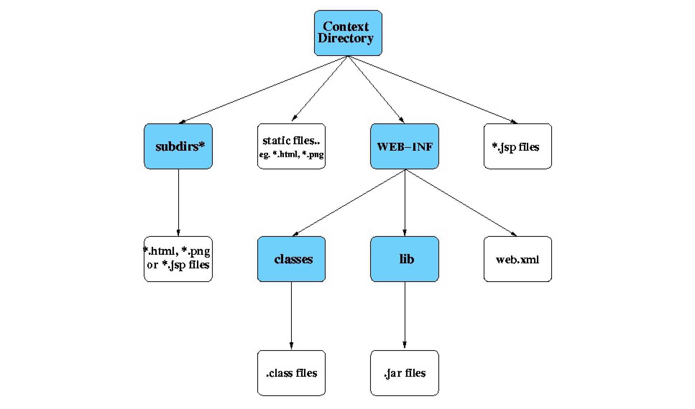

# url-pattern

## 匹配概述

`<url-pattern>`是我们用Servlet做Web项目时需要经常配置的标签，例：

```html
<servlet>
  <servlet-name>index</servlet-name>
  <servlet-class>club.banyuan.servlet.IndexServlet</servlet-class>
</servlet>
<servlet-mapping>
  <servlet-name>index</servlet-name>
  <url-pattern>/index</url-pattern>
</servlet-mapping>
```

当我们在浏览器的地址栏里输入http://localhost:8080/myapp/index时（假设部署在webapps目录下的项目名为myapp）

就会匹配到我们指定的`<url-pattern>`中，即/index然后一步一步找到对应的`<servlet-class>`

http://localhost:8080  是服务器地址，而该地址之后的部分统称为RequestURI

/myapp  是的ServletConext的上下文地址，称为ServletContext的 Path，可以简单理解为部署项目时的webapps目录下的项目名

/index  是Servlet的地址，称为Servlet的 Path，这里就是需要与`<url-pattern>`匹配的内容**。**

当浏览器发起一个url请求后，该请求发送到servlet容器的时候，容器先会将请求的url减去当前应用上下文的路径作为servlet的映射url，比如url是http://localhost/myapp/banyuan/detail.html，其应用上下文是myapp，容器会将http://localhost/myapp去掉，剩下的/banyuan/detail.html部分拿来做servlet的映射匹配。这个映射匹配过程是有优先顺序的(具体的优先顺序规则后面介绍)，而且当有一个servlet匹配成功以后，就不会去理会剩下的servlet了。

Filter的匹配规则与servlet一样，但对于filter，不会像servlet那样只匹配一个servlet，因为filter的集合是一个链，所以只会有处理的顺序不同，而不会出现只选择一个filter。Filter的处理顺序和filter-mapping在web.xml中定义的顺序相同。

## 匹配规则

### 精准匹配

`<url-pattern>`中配置的项必须与url完全精确匹配。

如配置信息如下：

```html
<servlet-mapping>
    <servlet-name>MyServlet</servlet-name>
    <url-pattern>/banyuan/detail.html</url-pattern>
    <url-pattern>/demo.html</url-pattern>
    <url-pattern>/table</url-pattern>
</servlet-mapping>
```

当在浏览器中输入如下几种url时，都会被匹配到该servlet
http://localhost/myapp/banyuan/detail.html
http://localhost/myapp/demo.html
http://localhost/myapp/table

注意：

http://localhost/myapp/table/ 不会被当作http://localhost/myapp/table识别，没有被servlet匹配到的url统统交给 url-pattern 为 `/`的servlet进行匹配，如果没有定义`/`的servlet，除了http://localhost/myapp/ 被处理，其他的无法匹配的url统统返回404

另外上述url后面可以跟任意的查询条件，都会被匹配，如

http://localhost/myapp/table?hello 这个请求就会被匹配到MyServlet。

### 扩展名匹配

匹配规则如下：

```html
<servlet-mapping>
    <servlet-name>MyServlet</servlet-name>
    <url-pattern>*.jsp</url-pattern>
</servlet-mapping>
```

则任何扩展名为jsp（文件名和路径任意）的url请求都会匹配，比如下面的url都会被匹配
http://localhost/myapp/demo.jsp
http://localhost/myapp/test.jsp

### 路径匹配

匹配规则如下：

```html
<servlet-mapping>
    <servlet-name>MyServlet</servlet-name>
    <url-pattern>/banyuan/*</url-pattern>
</servlet-mapping>
```

则请求的ulr只要前面（myapp之后）的路径是/banyuan，而后面的路径可以任意。比如下面的url都会被匹配。
http://localhost/myapp/banyuan/demo.html

http://localhost/myapp/banyuan/test.jsp

http://localhost/myapp/banyuan/test/detail.html

http://localhost/myapp/banyuan/action

### / 与 /*

```
<url-pattern>/*</url-pattern>
```

`/*`属于路径匹配，并且可以匹配所有request，由于路径匹配的优先级仅次于精确匹配，所以`/*`会覆盖所有的扩展名匹配，很多404错误均由此引起，所以这是一种特别恶劣的匹配模式，一般只用于filter的url-pattern

```
<url-pattern>/</url-pattern> 
```

`/`是servlet中特殊的匹配模式，该模式优先级最低，不会覆盖其他任何url-pattern，只是会替换servlet容器的内建default servlet ，如果我们的项目中配置了`/`，当其他的url-pattern匹配不上时都会走这个servlet，它会匹配静态资源如“.js”，“.css”，".png"等。但是JSP页面的请求`*.jsp`并不会命中这个servlet，servlet容器内建的JSP servlet已经映射了`*.jsp`的请求

### 优先顺序

当一个url与多个servlet的匹配规则可以匹配时，则按照 `精确路径 > 最长路径>扩展名`这样的优先级匹配到对应的servlet。举例如下：

例如

```
servletA 的 url-pattern为 /test
servletB 的 url-pattern为 /*
```

这个时候，如果访问的url为http://localhost/test ，容器就会先进行精确路径匹配，发现`/test`正好被servletA精确匹配，那么就去调用servletA，不会去管servletB。

例如

```
servletA 的 url-pattern为 /test/*
servletB 的 url-pattern为 /test/a/*
```

此时访问http://localhost/test/a时，容器会选择路径最长的servlet来匹配，也就是这里的servletB。 

例如

```
servletA 的 url-pattern为 *.action
servletB 的 url-pattern为 /* 
```

这个时候，如果访问的url为http://localhost/test.action，这个时候容器就会优先进行路径匹配，而不是去匹配扩展名，这样就去调用servletB。

### 需要注意的问题

匹配方法只有三种，要么是路径匹配（**以“/”字符开头，并以“/\*”结尾**），要么是扩展名匹配（**以“\*.”开头**），要么是精确匹配，三种匹配方法不能进行组合，不要想当然使用通配符或正则规则。

注意：路径和扩展名匹配无法同时设置，比如下面的三个`<url-pattern>`都是非法的，如果设置，启动tomcat服务器会报错。

```
<url-pattern>/banyuan/*.jsp</url-pattern>
<url-pattern>/*.jsp</url-pattern>
<url-pattern>he*.jsp</url-pattern>
```

另外注意：

```
<url-pattern>/aa/*/bb</url-pattern>
这个是精确匹配，url必须是 /aa/*/bb，这里的*不是通配的含义
```


# Sevlet版本

web.xml 头部信息中包含了版本的描述

maven webapp生成的web.xml版本

```
<!DOCTYPE web-app PUBLIC
 "-//Sun Microsystems, Inc.//DTD Web Application 2.3//EN"
 "http://java.sun.com/dtd/web-app_2_3.dtd" >
```


使用idea  facets 增加web 支持的servlet4版本

```
<?xml version="1.0" encoding="UTF-8"?>
<web-app xmlns="http://xmlns.jcp.org/xml/ns/javaee"
         xmlns:xsi="http://www.w3.org/2001/XMLSchema-instance"
         xsi:schemaLocation="http://xmlns.jcp.org/xml/ns/javaee http://xmlns.jcp.org/xml/ns/javaee/web-app_4_0.xsd"
         version="4.0">
</web-app>
```


servlet 3

```
<?xml version="1.0" encoding="UTF-8"?>
<web-app xmlns="http://java.sun.com/xml/ns/javaee"
           xmlns:xsi="http://www.w3.org/2001/XMLSchema-instance"
           xsi:schemaLocation="http://java.sun.com/xml/ns/javaee
		  http://java.sun.com/xml/ns/javaee/web-app_3_0.xsd"
           version="3.0">

</web-app>

```


tomcat和servlet版本的对应关系

http://tomcat.apache.org/whichversion.html


使用了servlet 4.0的包，如果使用了方法  `req.getHttpServletMapping()` 这个是4 新增的方法

使用maven  tomcat7-plugin 就会报错

```xml
<dependency>
  <groupId>javax.servlet</groupId>
  <artifactId>javax.servlet-api</artifactId>
  <version>4.0.1</version>
  <scope>provided</scope>
</dependency>
```


tomcat7x-maven-plugin  @WebFilter 不生效，原因是因为引入的servlet的版本有问题，引入 3.0.1即可

```xml
<dependency>
  <groupId>javax.servlet</groupId>
  <artifactId>javax.servlet-api</artifactId>
  <version>3.0.1</version>
  <scope>provided</scope>
</dependency>
```


servlet4.0 中的Filter 接口 init 和 destroy带有默认实现


# 浏览器路径和服务器路径

## 修改静态资源的路径

思路，增加过滤器，过滤静态资源的路径，forword到指定文件夹下

在过滤器中Forward 请求，将跳过过滤器的执行链后续的过滤器，直接由指定的servlet进行处理。

To recap what we said in the main JSP and Servlets document, every context directory has a partially fixed layout as shown below:



## 绝对路径和相对路径


### 前台

当前url 路径为  `http://localhost:8080/my-app/static/login.html`，其中my-app 为application-context路径

```html
<form action="/admin">
```

提交的路径为 ` http://localhost:8080/admin`


```html
<form action="admin">
```

提交的路径为 ` http://localhost:8080/my-app/static/admin`


